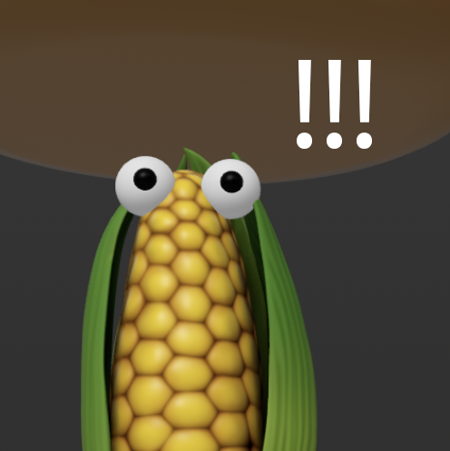

# Hit the Corn

A simple iOS AR game implemented with SwiftUI, RealityKit and ARKit similar to Whac-A-Mole game.

## Introduction

1. Open the App
2. Scan your surrounding area with coaching overlay
3. Hit the corn as they are emerging from the ground and have fun!

## Compile

1. Open this project with XCode on MacOS
2. Pick a physical device as build target since AR app can only be tested on a real device
3. Enable developer mode on your device
4. Build and run

### Useful links

https://developer.apple.com/documentation/xcode/running-your-app-in-simulator-or-on-a-device

https://developer.apple.com/documentation/xcode/enabling-developer-mode-on-a-device