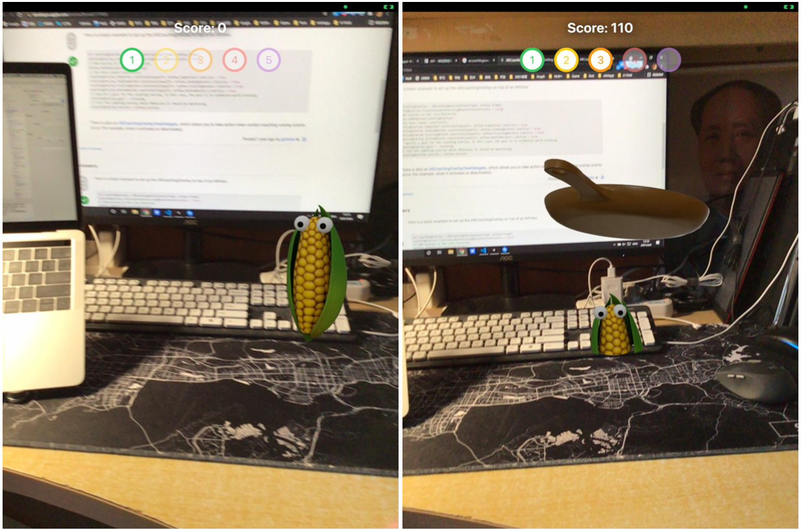

# Hit the Corn

a simple iOS AR game implemented with SwiftUI, RealityKit and ARKit

## Introduction

1. open the App
2. scan your surrounding area
3. hit the corn once they emerge from the ground and have fun!

## Compile

compile with XCode for iOS device